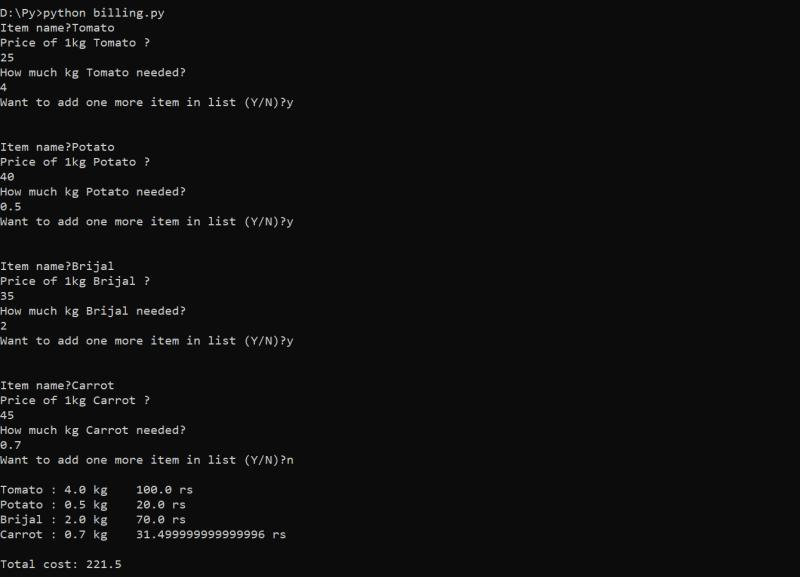

# Billing_Machine
There is a reason inorder to implement this basic code 😂

my uncle opened a vegetable shop...

he wanted to buy a billing machine for his shop.

so he took me to the shop where he can buy billing machine..

but there it costed more..

suddenly i got flashed about what i learnt basic knowledge in codinglife ..

so i installed python in my uncle's lappy and i implemented a basic #code such that it should work same as how billing machine works and i connected his lappy to small printer..

i know this sounds funny😂🏴..

but it is true😂...

i know what i coded is just a basic-basic code😂..

but in this what i want to show u people means...
when its come to programming even a small basic code or prg
can solve realistic problems

then just think what and all high level problems u can solve if u learn coding in high level...

so be good at coding..

it helps u to how to think🔥...

Refer below image to know how my code works..

